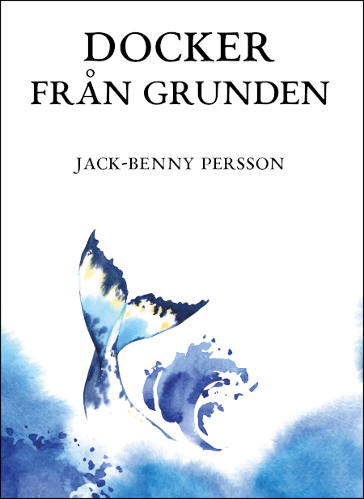

# Docker från grunden
Här finner du filer för boken *Docker från grunden* (ISBN: 978-91-983300-6-9).
Exempelvis finns här alla `Dockerfile`- och `docker-compose.yml`-filer. Här
finns även annan exempelkod som används i boken, så som Bash-skript och
HTML-filer.

Boken går att köpa från [CyberInfo Sverige](https://www.cyberinfo.se/bocker/),
[Bokus](https://www.bokus.com/bok/9789198330069/docker-fran-grunden/) och
[Adlibris](https://www.adlibris.com/se/bok/docker-fran-grunden-9789198330069).

Är du nyfiken på boken så titta gärna i [innehållsförteckningen](https://www.cyberinfo.se/dokument/docker-fran-grunden_innehallsforteckning.html).

## Baksidetexten
**Docker från grunden** lär dig allt du behöver för att komma igång med Docker
på egen hand. Du lär dig alltifrån vad Docker är, hur du startar och stoppar
containrar, hur du paketerar egna program i avbilder, hur du bygger ett eget
Docker-register till hur du sätter upp tjänster på datorn med Docker. Du lär
dig även att automatisera hela miljöer med Docker Compose.

Docker har förändrat it-världen på kort tid. Det går nu att bygga kompletta
miljöer och fritt flytta dem mellan olika plattformar - något som förut varit
tidskrävande och omständligt. Det går dessutom att automatisera så att en hel
miljö kan startas och stoppas med ett enda kommando. Även för utvecklaren har
saker förändrats och förenklats med Docker. Hon kan nu paketera hela sitt
program som en Docker-avbild och dela den med omvärlden på exempelvis Docker
Hub, och den går att köra på i princip vilken dator som helst.

Boken behandlar både traditionella Docker som körs under root-användaren, men
även Docker i rootless-mode.

Boken är praktiskt orienterad med en lång rad exempel och övningar. Det finns
även ett par större projekt i boken. Efter varje kapitel finns en rad
övningsuppgifter. En del av uppgifterna går utanför vad boken lärt ut för att
du ska hitta lösningar på egen hand.

Ett helt kapitel är dedikerat åt säkerhet. Här ser vi också exempel på attacker
mot Docker och hur man kan bryta sig ur en container.

## Framsida

